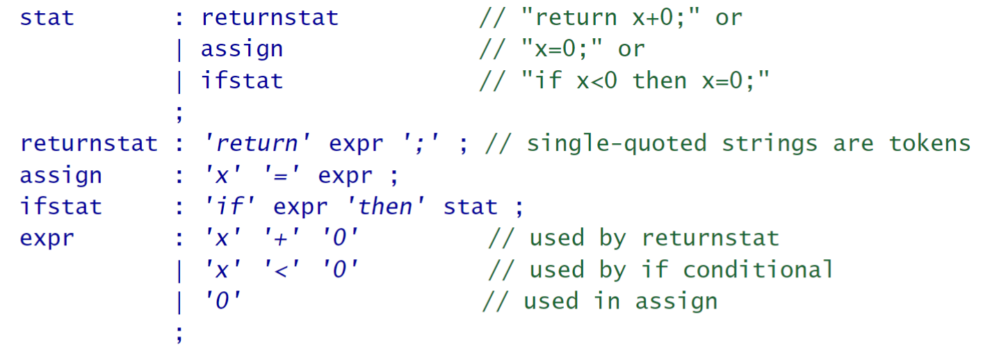
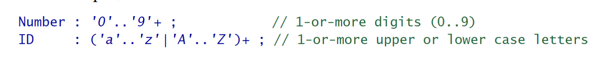
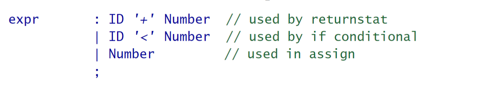

## Basic Parsing Patterns
To recognize a phrase means 2 things:
* we can distinguish it from other constructs in that language.
* we can identify the elements and substructures of the phrase.

The act of recognizing a phrase by computer is called parsing.

As usual, there is a trade-off between parser simplicity and parser strength,four basic parser design patterns:
* **Pattern 1**: Mapping Grammars to *Recursive-Descent Recognizer*
* **Pattern 2**: LL(1) *Recursive-Descent Lexer*, breaking up char streams into tokens
* **Pattern 3**: LL(1) *Recursive-Descent Parser*,
* **Pattern 4**:LL(k) *Recursive-Descent Parser*,

You can think of grammars as functional specifications or design documents for parsers. Grammars are more than designs, though. They are actually executable “programs” written in a domain-specific language (DSL) specifically designed for expressing language structures.

### 2.1 Identifying phrase structure
syntax analysis: identify the vocabulary symbols in programming language like *variable* and *operator*. even identify the role of token subsequences like ***expression***

Parse trees are important because they tell us everything we need to know about the syntax (structure) of a phrase.

### 2.2 Building Recursive-Descent Parsers
To avoid building parse trees, we trace them out implicitly via a function call sequence (a call tree). 

e.g.:
```java
/** To parse a statement: `return x+1;`, call stat(); */
void stat() { returnStat(); }
void returnStat() { match("return" ); expr(); match(";" ); }
void expr() { match("x" ); match("+" ); match("1" ); }
```
if we  want to parse the three kinds of statements found in our parse trees: if, return, and assignment statements. :
```
void stat() {
if ( «lookahead token is return» ) returnStat();
else if ( «lookahead token is identifier» ) assign();
else if ( «lookahead token is if » ) ifStat();
else «parse error»
}
```
call this kind of parser a *top-down parser*

### 2.3 Parser Construction Using a Grammar DSL
ANTLR grammar:


### 2.4 Tokenizing Sentences
Recognize character streams are called tokenizers or lexers.At the character level, we refer to syntax as the lexical structure.so we can also use **Grammar** for lexical specifications:



### **Pattern 1: Mapping Grammars to Recursive-Descent Recognizers**
#### Purpose
*translates a grammar to recursive-descent recognizer that matches phrases and sentences in the language specified by the grammar*, it identifies the core control-flow framework for any recursive-descent lexer,parser.

#### Discussion


